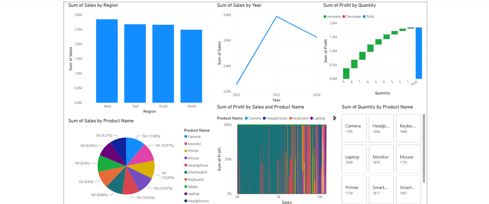

# Data Cleaning & Reporting Automation

## 📌 Project Overview

This project focuses on cleaning raw sales data using Python and creating a dashboard to generate useful business insights.

The project automates basic data cleaning tasks such as removing duplicate records and handling missing values. The cleaned dataset is then used for reporting and dashboard visualization.

## 🎯 Objective

The main objectives of this project are:

- Clean raw sales data
- Remove duplicate records
- Handle missing values
- Create a cleaned dataset
- Generate useful sales and profit insights
- Present the results through a dashboard

## 🛠️ Technologies Used

- Python
- Pandas
- Excel / Dashboard
- Data Visualization

## 📊 Dataset

The dataset contains sales transaction details with the following columns:

- **Order Date** – Date of the order
- **Product Name** – Name of the product
- **Category** – Product category
- **Region** – Sales region
- **Quantity** – Number of items sold
- **Sales** – Sales amount
- **Profit** – Profit generated

## 🔍 Data Cleaning Process

The following steps were performed using Python:

1. Loaded the raw sales dataset using Pandas.
2. Displayed the original data.
3. Removed duplicate records.
4. Handled missing values using forward fill.
5. Displayed the cleaned data.
6. Saved the cleaned dataset as `cleaned_data.csv`.

## 📈 Dashboard

The cleaned dataset was used to create a dashboard for reporting and visualization.

The dashboard helps analyze:

- Sales performance
- Profit
- Quantity sold
- Product categories
- Regional performance

## 📷 Dashboard Preview



## 📁 Project Structure

```text
Data Cleaning & Reporting Automation/
│
├── cleaning.py
├── sales_data.csv
├── cleaned_data.csv
├── Dashboard.png
└── README.md